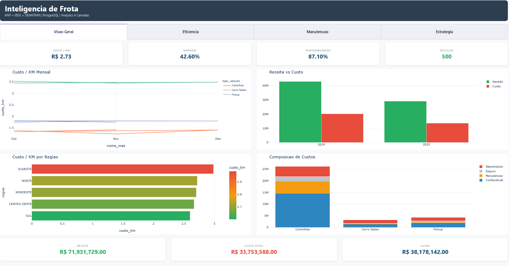
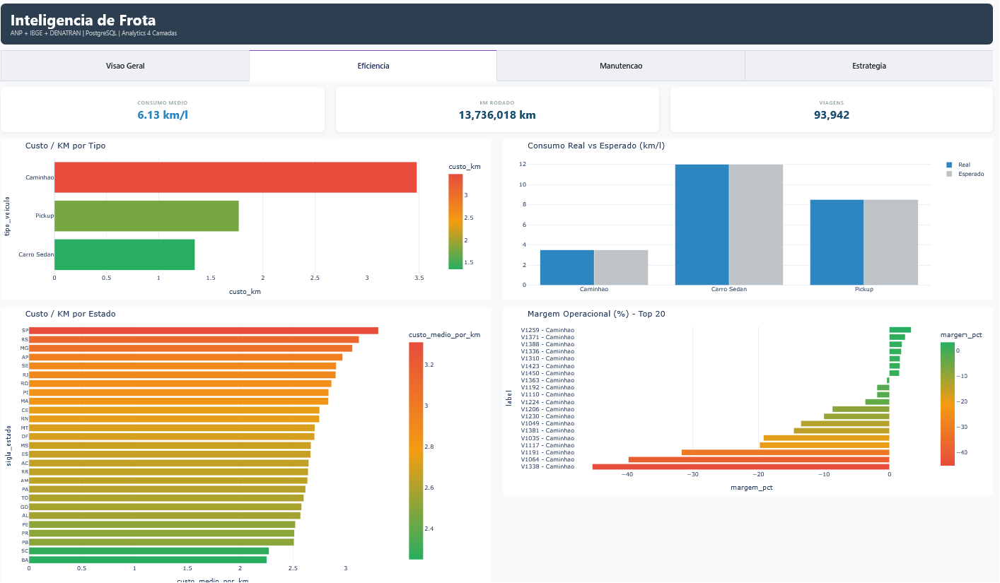
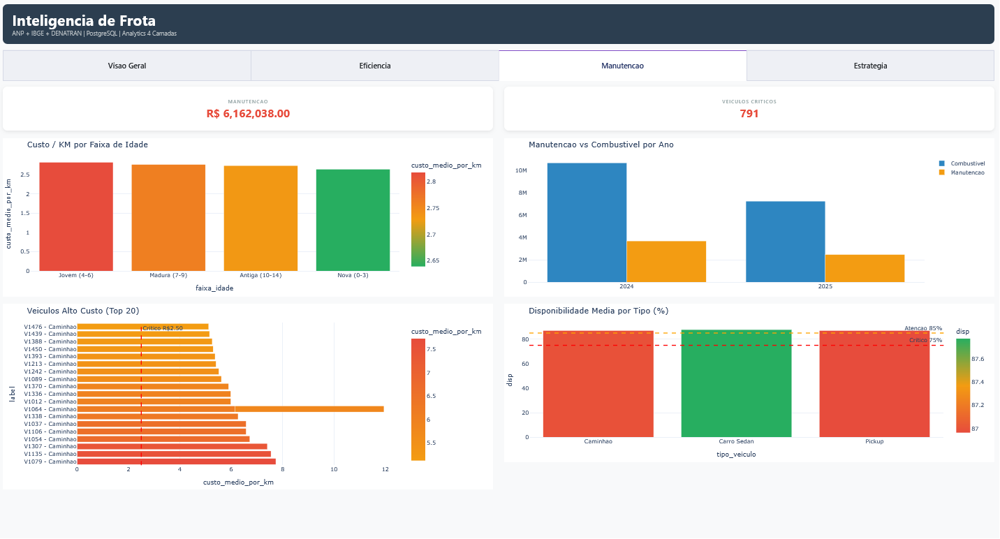
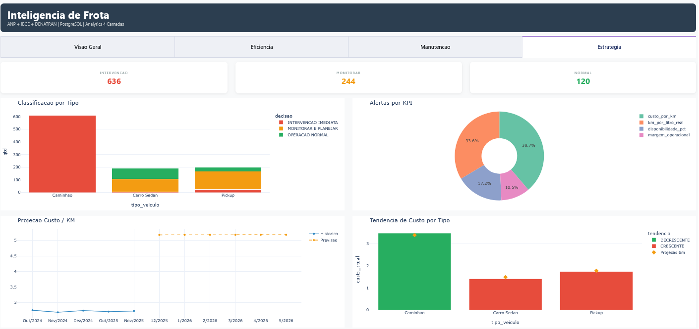

<div align="center">

# Inteligencia de Frota

**Pipeline completo de inteligencia analitica para gestao de frotas de saneamento**

*Ingestao de dados reais | ETL | Data Warehouse | Analytics 4 camadas | Orquestracao*

---

</div>

## Sobre o Projeto

Sistema end-to-end de inteligencia de dados para operacoes de frotas de empresas de saneamento, integrando **3 fontes de dados reais do governo brasileiro** (ANP, IBGE, DENATRAN) em um pipeline automatizado que vai da ingestao bruta ate recomendacoes prescritivas de acao.

A frota e composta por **Caminhoes** (core operacional - 60%), **Pickups** (apoio campo - 20%) e **Carros Sedan** (deslocamento administrativo - 20%), refletindo a realidade de uma empresa de saneamento basico.

O pipeline responde as 4 perguntas fundamentais de gestao:

| Camada | Pergunta | Entrega |
|--------|----------|---------|
| **Descritiva** | O que esta acontecendo? | KPIs de custo, consumo e utilizacao |
| **Diagnostica** | Por que esta acontecendo? | Causa raiz: combustivel, manutencao ou idade |
| **Preditiva** | O que vai acontecer? | Forecast de custo/km (R2=0.95) |
| **Prescritiva** | O que fazer? | Acao concreta: substituir, monitorar ou manter |

---

## Arquitetura

```
                          FONTES REAIS
                    +---------+----------+----------+
                    |   ANP   |   IBGE   | DENATRAN |
                    | Preco   |  IPCA    |  Frota   |
                    | Combust.| PIB/Sal. |  por UF  |
                    +----+----+----+-----+----+-----+
                         |         |          |
                    +----v---------v----------v-----+
                    |        INGESTAO (Python)       |
                    |  anp_fuel | ibge_api | denatran |
                    |       fleet_generator          |
                    +--------------+-----------------+
                                   |
                    +--------------v-----------------+
                    |          ETL (Python)          |
                    |  Limpeza -> Padronizacao ->    |
                    |  Enriquecimento (JOIN por UF)  |
                    +--------------+-----------------+
                                   |
                    +--------------v-----------------+
                    |     DATA WAREHOUSE (PostgreSQL)|
                    |     Modelo Estrela + 7 Views   |
                    +--+------------+-----------+----+
                       |            |            |
          +-----------v--+ +-------v----------+--+
          |  DESCRITIVA  | |   DIAGNOSTICA      |
          |  KPIs SQL    | |   Root Cause SQL   |
          +--------------+ +--------------------+
          +--------------+ +--------------------+
          |  PREDITIVA   | |   PRESCRITIVA      |
          |  Regressao + | |   Regras de decisao|
          |  ARIMA       | |   classificacao KPI|
          +--------------+ +--------------------+
```

---

## Tecnologias

| Categoria | Tecnologia | Uso |
|-----------|-----------|-----|
| **Linguagem** | Python 3.14 | Pipeline, ETL, Analytics, Orquestracao |
| **Banco de Dados** | PostgreSQL 18 | Data Warehouse (producao) |
| **Banco de Dados** | SQLite | Data Warehouse (desenvolvimento) |
| **ML / Estatistica** | scikit-learn | Regressao linear (R2=0.95) |
| **ML / Estatistica** | statsmodels | ARIMA(1,1,1) - series temporais |
| **Processamento** | Pandas + NumPy | Transformacao e enriquecimento |
| **Ingestao** | Requests | API IBGE + download ANP |
| **Visualizacao** | Plotly Dash | Dashboard web interativo (4 abas) |
| **Orquestracao** | Apache Airflow | DAG com 8 tasks (opcional) |
| **Configuracao** | YAML | Settings centralizados |

---

## Fontes de Dados Reais

| Fonte | Dados | Cobertura | Registro |
|-------|-------|-----------|----------|
| **ANP** | Precos de combustiveis por UF | 27 estados, 6 produtos, 12 meses | 1.944 |
| **IBGE** | IPCA, PIB per capita, Salario medio, Populacao | 27 estados, 7 anos | 756 |
| **DENATRAN** | Frota por tipo e UF | 27 estados, 18 tipos, 7 anos | 3.402 |
| **Operacional** | Dados de frota simulados | 500 veiculos, 24 meses | 12.000 |

> Quando as fontes oficiais estao indisponiveis (URLs mudam sem aviso), o pipeline gera dados baseados nas **estatisticas reais publicadas** por cada orgao. Os numeros respeitam a distribuicao real da frota brasileira (~58M veiculos), precos medidos e indicadores oficiais.

---

## Frota de Saneamento

| Tipo | Quantidade | Percentual | Funcao |
|------|-----------|-----------|--------|
| **Caminhao** | 304 | 60% | Core operacional (coleta, transporte, deslocamento) |
| **Pickup** | 100 | 20% | Apoio de campo (vistoria, manutencao externa) |
| **Carro Sedan** | 96 | 20% | Deslocamento administrativo (reunioes, supervisao) |

---

## Data Warehouse

### Modelo Estrela

```
              dim_tempo          dim_estado
             (sk_tempo)         (sk_estado)
              ano, mes          sigla, regiao
              trimestre
                 |                  |
                 |                  |
                 v                  v
             +--------------------------+
             |       fato_frota         |
             |  sk_fato, sk_veiculo,    |
             |  sk_estado, sk_tempo     |
             |  km, litros, precos,    |
             |  custos, receita,       |
             |  margem, custo/km       |
             +----------+---------------+
                        |
                        v
                  dim_veiculo
                 (sk_veiculo)
                tipo, marca, ano
                combustivel, status
```

### Volumes no PostgreSQL

| Tabela | Registros | Chave |
|--------|-----------|-------|
| `dim_tempo` | 24 | sk_tempo |
| `dim_estado` | 27 | sk_estado |
| `dim_veiculo` | 500 | sk_veiculo |
| `fato_frota` | 2.500 | sk_fato_frota |

### 7 Views Analiticas

| View | Funcao |
|------|--------|
| `vw_resumo_mensal` | KPIs agregados por mes |
| `vw_kpi_estado` | KPIs por estado e regiao |
| `vw_kpi_tipo_veiculo` | KPIs por tipo e combustivel |
| `vw_veiculos_alto_custo` | Ranking de ineficiencia (custo/km > 1.50) |
| `vw_impacto_combustivel` | Correlacao preco vs custo operacional |
| `vw_eficiencia_idade` | Eficiencia por faixa de idade |
| `vw_ranking_margem` | Ranking por margem operacional |

---

## Analytics em 4 Camadas

### 1. Descritiva - O que esta acontecendo?

```sql
-- Custo por km decomposto em 3 componentes
SELECT tipo_veiculo, estado, ano, mes,
       custo_combustivel_por_km,
       custo_manutencao_por_km,
       componente_fixo
FROM vw_kpi_tipo_veiculo;
```

KPIs calculados: custo/km, consumo medio (km/l), utilizacao da frota (%), composicao de custos (%), rentabilidade (margem %).

### 2. Diagnostica - Por que esta acontecendo?

```sql
-- Veiculos com consumo anomalo (> 30% abaixo do esperado)
SELECT veiculo_id, estado, tipo_veiculo,
       consumo_real, consumo_esperado,
       desvio_consumo_pct,
       CASE WHEN desvio > 30 THEN 'ANOMALO' ELSE 'NORMAL' END
FROM vw_impacto_combustivel;
```

Identifica: impacto do preco de combustivel no custo, veiculos com maior custo, principal causa por faixa de idade, anomalias regionais de consumo.

### 3. Preditiva - O que vai acontecer?

| Modelo | Metrica | Resultado |
|--------|---------|-----------|
| Regressao Linear | R2 | 0.95 |
| Regressao Linear | MAE | 0.004 |
| ARIMA(1,1,1) | AIC | -15.66 |
| Tendencia por tipo | 3 tipos classificados | Crescente/Decrescente |

Forecast de 6 meses para custo/km, com tendencia por tipo de veiculo (ex: Caminhao = DECRESCENTE, Pickup = CRESCENTE).

### 4. Prescritiva - O que fazer?

```
Resultado: 1.000 veiculos analisados
+-- 636 -> INTERVENCAO IMEDIATA  (acao: substituir ou revisar)
+-- 244 -> MONITORAR E PLANEJAR (acao: agendar manutencao)
+-- 120 -> OPERACAO NORMAL      (acao: manter padrao)
```

Cada veiculo e avaliado em 4 KPIs contra limites criticos, com acao recomendada:

| KPI | Limite Critico | Acao |
|-----|---------------|------|
| custo_por_km | > R$ 2.50 | Substituir veiculo ou revisar operacao |
| margem_operacional | < 10% | Rever rota e composicao de custos |
| disponibilidade | < 75% | Ampliar reserva ou terceirizar |
| km_por_litro | < 3.0 km/l | Inspecionar motor e pneus |

---

## Dashboard Web (Plotly Dash)

Dashboard interativo com 4 abas conectado ao PostgreSQL em tempo real:

### Visao Geral
KPIs financeiros, custo/KM mensal por tipo de veiculo, receita vs custo por ano, composicao de custos por tipo e regiao.



### Eficiencia
Consumo real vs esperado por tipo, custo/KM por estado (27 UFs), ranking de margem operacional.



### Manutencao
Custo/KM por faixa de idade do veiculo, manutencao vs combustivel por ano, veiculos alto custo com limiar critico, disponibilidade por tipo.



### Estrategia
Classificacao prescritiva (intervencao / monitorar / normal), alertas por KPI, projecao de custo/KM (forecast), tabela de acoes com formatacao condicional.



Acesso: `python dashboard/dashboard.py` -> http://localhost:8050

---

## Estrutura do Projeto

```
inteligencia_frota/
+-- ingestion/                    # Ingestao de dados
|   +-- anp_fuel.py              # Precos combustivel (ANP)
|   +-- ibge_api.py              # Indicadores economicos (IBGE API v3)
|   +-- denatran_loader.py       # Base de frota (DENATRAN)
|   +-- fleet_generator.py       # Gerador de operacao de frota
+-- etl/
|   +-- transform.py             # Limpeza -> Padronizacao -> Enriquecimento
+-- data/raw/                     # Dados brutos (CSV)
+-- staging/                      # Dados processados (checkpoint ETL)
+-- load.py                       # Carga no DW (PostgreSQL / SQLite)
+-- warehouse/
|   +-- ddl.sql                  # Modelo estrela (4 tabelas + 4 indices)
|   +-- dml.sql                  # Dados referencia (limites, faixas)
|   +-- views.sql                # 7 views analiticas
+-- analytics/
|   +-- descriptive/kpis.sql     # 5 queries descritivas
|   +-- diagnostic/root_cause.sql # 5 queries diagnosticas
|   +-- predictive/forecast.py  # Regressao + ARIMA + Tendencia
|   +-- prescriptive/decision_rules.py # Regras de decisao + alertas
+-- orchestration/
|   +-- fleet_pipeline_dag.py   # DAG Airflow (8 tasks) + standalone
+-- dashboard/
|   +-- dashboard.py             # Dashboard Plotly Dash (4 abas)
+-- config/settings.yaml         # Configuracao centralizada
+-- logs/
+-- requirements.txt
+-- README.md
```

---

## Quick Start

### Instalacao

```bash
# Clonar o repositorio
git clone https://github.com/diego-dev/inteligencia_frota.git
cd inteligencia_frota

# Criar ambiente virtual
python -m venv venv
source venv/bin/activate        # Linux/Mac
# venv\Scripts\activate         # Windows

# Instalar dependencias
pip install -r requirements.txt
```

### PostgreSQL (producao)

```bash
# Criar banco
psql -U postgres -c "CREATE DATABASE inteligencia_frota;"

# Executar pipeline completo
python orchestration/fleet_pipeline_dag.py

# Ou executar passo a passo
python ingestion/anp_fuel.py
python ingestion/ibge_api.py
python ingestion/denatran_loader.py
python ingestion/fleet_generator.py
python etl/transform.py
python load.py --engine postgresql
python analytics/predictive/forecast.py
python analytics/prescriptive/decision_rules.py
```

### Dashboard Web

```bash
python dashboard/dashboard.py
# Acesse http://localhost:8050
```

### Apache Airflow (orquestracao agendada)

```bash
export AIRFLOW_HOME=./airflow
airflow db init
cp orchestration/fleet_pipeline_dag.py $AIRFLOW_HOME/dags/
airflow scheduler &
airflow webserver
airflow dags trigger fleet_intelligence_pipeline
```

### Consultas diretas no PostgreSQL

```bash
psql -U postgres -d inteligencia_frota -c "SELECT * FROM vw_resumo_mensal;"
psql -U postgres -d inteligencia_frota -c "SELECT * FROM vw_kpi_estado ORDER BY custo_medio_por_km DESC;"
psql -U postgres -d inteligencia_frota -c "SELECT * FROM vw_veiculos_alto_custo LIMIT 10;"
```

---

## Resultados

| Metrica | Valor |
|---------|-------|
| Fontes integradas | 3 reais + 1 operacional |
| Registros processados | 18.102 (ingestao) -> 12.000 (ETL) -> 2.500 (DW) |
| Tipos de veiculo | 3 (Caminhao, Pickup, Carro Sedan) |
| Tabelas DW | 4 (modelo estrela) |
| Views analiticas | 7 |
| KPIs monitorados | 4 (custo/km, margem, disponibilidade, consumo) |
| Modelos preditivos | 3 (Regressao, ARIMA, Tendencia) |
| Veiculos analisados | 1.000 |
| Alertas gerados | 1.812 (636 criticos + 1.176 atencao) |
| Acuracia regressao | R2 = 0.95 |

---

## Decisoes Tecnicas

| Decisao | Justificativa |
|---------|---------------|
| Modelo estrela | Permite qualquer corte analitico com SQL simples |
| PostgreSQL + SQLite | Producao e desenvolvimento local sem dependencia |
| Fallback em ingestao | ANP/IBGE/DENATRAN mudam URLs sem aviso - pipeline nunca quebra |
| Dados simulados realistas | Baseados em estatisticas oficiais publicadas |
| Frota focada em 3 tipos | Reflexo real de empresa de saneamento basico |
| Views no banco | Materializam logica de negocio, consome de qualquer BI |
| `CREATE OR REPLACE VIEW` | Compativel com PostgreSQL |
| `psycopg2-binary` | Evita compilacao de libpq no Windows |
| Seed fixa (42) | Reprodutibilidade dos dados operacionais |
| Limites em tabela | Regras de negocio no banco, nao hardcoded |
| Airflow opcional | DAG funciona em modo standalone |

---

##Autor
Diego Menezes
Data Analyst | Python | SQL | Power BI

